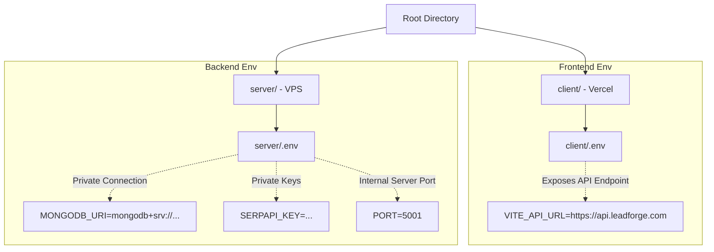

# LeadForge Elite — Production Deployment Guide

Yes! You have planned the **absolute industry-standard professional structure** for hosting a MERN stack. Having a separate `client/` and `server/` folder inside a root repository is extremely clean and used globally by modern product teams.

Here is the perfect folder structure verification, a breakdown of how the domains connect, and step-by-step deployment instructions.

---

## 📁 1. The Perfect Folder & Environment Setup

In production, you want your frontend and backend environments kept **completely separate**:



### Why this is secure & correct:
- **`server/.env`**: Contains database credentials, API access keys, and system secrets. These are stored securely on your private VPS and are **never exposed to the browser**.
- **`client/.env`**: Contains public-facing configuration variables like `VITE_API_URL`. In Vite, variables prefixed with `VITE_` are bundled securely into client-side code so the browser knows where to send requests.

---

## 🌐 2. Domain & DNS Configuration

You are **100% correct** about custom domains and nameservers! Here is exactly how you connect them:

| Subdomain/Domain | Points To | Configured Via |
| :--- | :--- | :--- |
| **`leadforge.com`** | Vercel Static Servers | Vercel Custom Domain panel (CNAME / IP records) |
| **`api.leadforge.com`** | VPS Static IP Address | A record in your DNS provider (e.g. Cloudflare, GoDaddy) |

### DNS Configuration Steps:
1. Log in to your DNS provider (e.g. GoDaddy, Namecheap, Cloudflare).
2. Create an **A Record**:
   - **Host/Name**: `api`
   - **Value**: `[Your VPS Public IP Address]`
3. Connect your main domain `leadforge.com` in your Vercel Dashboard under **Project Settings > Domains**. Vercel will give you a target `CNAME` or `A record` to paste into your DNS manager.

---

## ⚡ 3. The Professional Route: Vercel Rewrite (No Code Changes & No CORS Errors)

Locally, you are making requests to relative paths (e.g. `fetch('/api/leads')`).
- Locally, Vite uses a development proxy to route `/api` to `http://localhost:5001`.
- **In production (Vercel), that Vite proxy does not exist!**

If you try to prepending `https://api.leadforge.com` to every request in your codebase, browsers will throw **CORS (Cross-Origin Resource Sharing)** blocking errors unless configured perfectly.

### The Professional Vercel Rewrite Solution:
Instead of changing any code on your frontend, we can create a `vercel.json` file inside your `client/` folder. This tells Vercel to transparently route all frontend requests starting with `/api/` directly to your VPS subdomain `https://api.leadforge.com/api/` at the CDN level.

#### [NEW] [vercel.json](file:///Users/koushiksarkar/Desktop/lead_genaration_tool/client/vercel.json)
Create a new file in your `client/` folder with the following contents:
```json
{
  "rewrites": [
    {
      "source": "/api/:path*",
      "destination": "https://api.leadforge.com/api/:path*"
    }
  ]
```
*(This allows `fetch('/api/leads')` to work flawlessly in both development and production with **zero code modifications**!)*

---

## 🚀 4. Step-by-Step Deployment Walkthrough

### Part A: Deploying the Backend on your VPS

1. **Prepare your VPS**:
   Connect to your VPS via SSH:
   ```bash
   ssh root@your_vps_ip
   ```
2. **Install Node.js & PM2**:
   PM2 is a production process manager that keeps your backend running 24/7 and restarts it automatically if it crashes.
   ```bash
   curl -fsSL https://deb.nodesource.com/setup_20.x | sudo -E bash -
   sudo apt-get install -y nodejs
   sudo npm install -y -g pm2
   ```
3. **Pull Backend Code & Run**:
   Clone your repository, navigate to `server/`, create your production `.env`, and start the backend:
   ```bash
   git clone https://github.com/your-username/leadforge-elite.git
   cd leadforge-elite/server
   npm install --omit=dev
   nano .env
   # Add your production database MONGODB_URI and SERPAPI_KEY keys here!
   
   # Start server with PM2
   pm2 start src/index.js --name "leadforge-api"
   pm2 startup
   pm2 save
   ```
4. **Configure Nginx as a Reverse Proxy (Port 80/443 -> Port 5001)**:
   This directs traffic from your domain `api.leadforge.com` into your node port `5001`.
   ```bash
   sudo apt install -y nginx
   sudo nano /etc/nginx/sites-available/api.leadforge.com
   ```
   Paste the Nginx configuration:
   ```nginx
   server {
       server_name api.leadforge.com;

       location / {
           proxy_pass http://localhost:5001;
           proxy_http_version 1.1;
           proxy_set_header Upgrade $http_upgrade;
           proxy_set_header Connection 'upgrade';
           proxy_set_header Host $host;
           proxy_cache_bypass $http_upgrade;
       }
   }
   ```
   Link the config and restart Nginx:
   ```bash
   sudo ln -s /etc/nginx/sites-available/api.leadforge.com /etc/nginx/sites-enabled/
   sudo systemctl restart nginx
   ```
5. **Secure with Let's Encrypt SSL (HTTPS)**:
   Make your subdomain completely secure (`https://api.leadforge.com`):
   ```bash
   sudo apt install -y certbot python3-certbot-nginx
   sudo certbot --nginx -d api.leadforge.com
   ```
   *(Select `Redirect` to force all traffic to HTTPS).*

---

### Part B: Deploying the Frontend on Vercel

1. Log in to **[Vercel](https://vercel.com/)** and click **Add New Project**.
2. Connect your Git repository.
3. Configure the Project Settings:
   - **Framework Preset**: `Vite`
   - **Root Directory**: `client`
   - **Build Command**: `npm run build`
   - **Output Directory**: `dist`
4. Add **Environment Variables**:
   Under Environment Variables, add:
   - **Key**: `VITE_API_URL`
   - **Value**: `https://api.leadforge.com`
5. Click **Deploy**. Vercel will compile the React code and host it instantly.
6. Connect your main domain `leadforge.com` under **Project Settings > Domains**.
